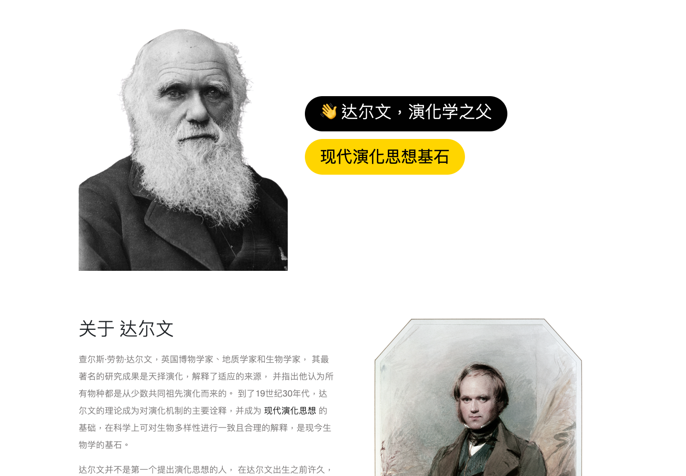
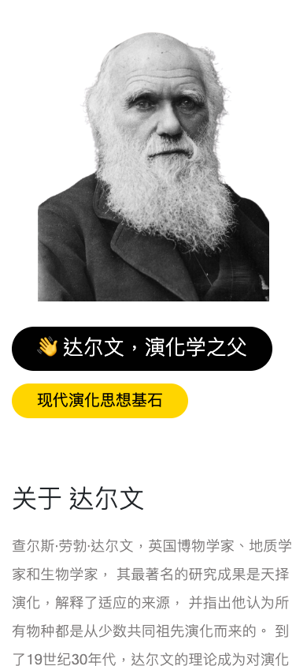

# 🌿 查尔斯·劳勃·达尔文

<p align="center">
  
</p>

<p align="center">
  
  
  
  
  
</p>

<p align="center">
  一个关于查尔斯·劳勃·达尔文的单页人物展示站。<br>
  从生平故事、代表著作到“小猎犬号”航行，把演化论背后的科学旅程用网页呈现出来。
</p>

## ✨ 页面预览

| 桌面版 | 手机版 |
| --- | --- |
|  |  |

## 🧭 你可以看到什么

- 👤 达尔文的人物简介与基础资料
- 📚 《物种起源》等代表著作介绍
- 🏅 皇家奖章、沃拉斯顿奖章、科普利奖章展示
- 🚢 “小猎犬号航行之旅”故事折叠区
- 📱 适配桌面端与移动端浏览

## 🛠 使用技术

- HTML5
- CSS3 / Bootstrap
- JavaScript / jQuery / Bootstrap

## 🚀 本地运行

直接在浏览器中打开：

```text
index.html
```

也可以用任意静态文件服务器预览仓库根目录。

## 📁 项目结构

```text
.
├── index.html
├── css/
├── js/
├── images/
├── localfonts/
├── docs/
│   └── screenshots/
└── LICENSE
```

## 📄 授权

本项目使用 [MIT License](LICENSE)。
